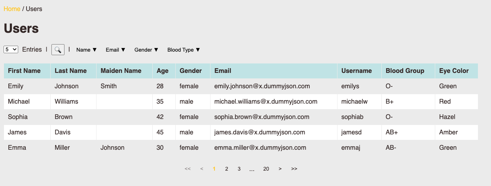

# React dummyjson app

## Prerequisites

1. Node (v.22)
2. (optional) Docker

## Running the application

### Node

`npm install`
`npm start`

The app is available at `http://localhost:3000`

### Docker

`docker-compose up`

The app is available at `http://localhost:3000`

## Unit Tests

Run `npm test`
